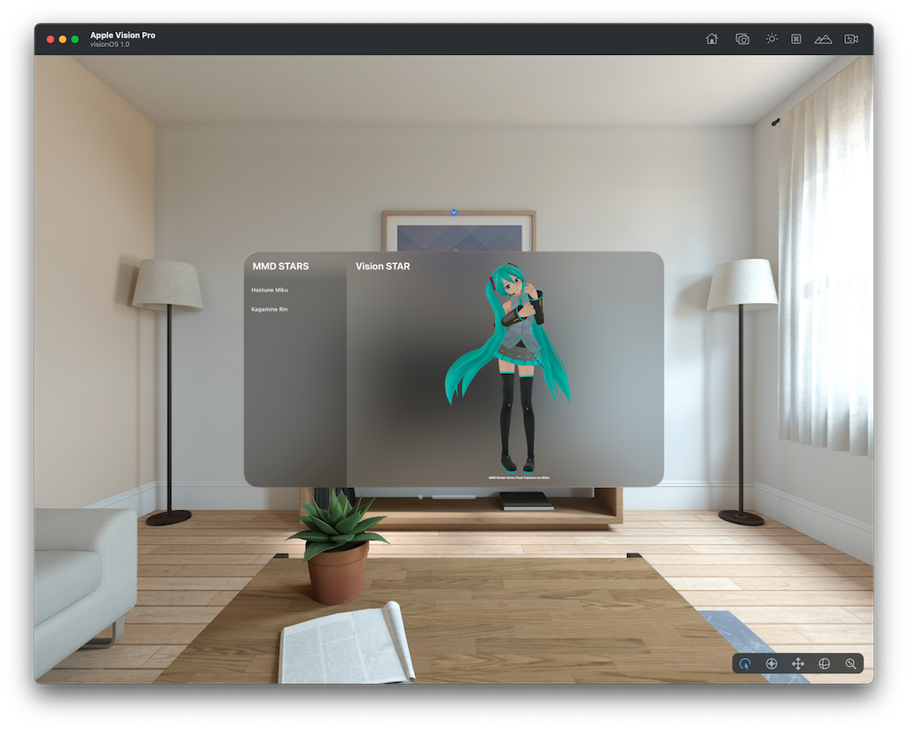
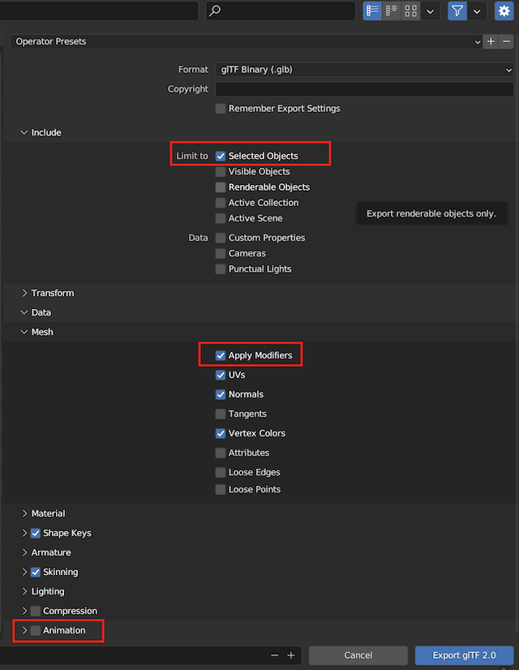

# Hastune Miku on Vision Pro

[English README](README.md)

## プロジェクトの目的
バーチャルシンガーの初音ミクには、性別、年齢、文化を問わず、世界中に多くのファンがいます。そこで私は、彼女を Apple Vision Pro で動かしたい思いました。そのためには彼女の3次元モデルである「ミクミクダンスフォーマット」を、 ピクサー社の 「USDZ フォーマット」 に変換する必要があります。しかし明確な手順はインターネットで見つかりませんでした。そこで何かの役に立てるかも知れないと思い、私が行った方法をGitHubでシェアします。またその過程で私には解決できない問題に遭遇しました。コミュニティの皆さんに教えていただけることを願っています。

  
## インストールと実行
vision プログラムのスタータテンプレートを利用し、とりあえず彼女にポーズをつけてロードしました。
このリポジトリをクローンし、XCode 15.0 beta で開いてください。Vision Pro のシミュレータを起動すると、彼女が表示されます。

　
## リポジトリにあるモデルを直接見る - 配布は禁止
表示しているモデルはこのリポジトリに含まれています。ファイル名は v211_moko_03.usdz です。これをダウンロードし、たとえば mac の preview 等で直接見ることも可能です。
しかしこのモデルを配布することは、初音ミクの著作権者によって禁止されています。詳しくはライセンス条項をご覧ください。

  
## ミクミクダンスフォーマットを USDZ に変換する方法
私は以下の方法でMMDフォーマットをUSDZに変換しました。

  
#### 主なステップ
 * Blendar に 初音ミクの3次元モデルをインポートします。
 * インポートしたモデルにポーズを適用します。
 * これを glTF 2.0 形式でイクスポートします。
 * RealityConveter で glTF を USDZ に変換します。

  
#### 用意するツール
 * Blendar 3.6.1
 * Blendarの Add On mmd_tools 2.8.1
  - ダウンロード先はこちらです https://github.com/UuuNyaa/blender_mmd_tools
 * RealityConverter

  
#### モデルとポーズをダウンロード
 * 初音ミクの3次元モデルをダウンロードします。DevianArt で検索すればたくさん見つかります。ダウンロードするファイルの拡張子は pmx です。
  - 私はこのリンク https://www.deviantart.com/mavaphia/art/Download-Series-Koron-Miku-V2-767399172 をたどって Koron V2.1.1 を使用しました。
 * ポーズファイルをダウンロードします。これも DevianArt 等で 'MMD Pose' 等で検索すればたくさん出てきます。ファイルの拡張子は vpd です。
  - 私はこのリンクから https://www.deviantart.com/fujiwara-no-moko/art/Pose-pack-Download-827831384 Fujiwara-no-Moko No.3 を使用しました。

  
#### 骨格とポーズ
 * 一口に初音ミクと言っても、多くのクリエイターが独自のモデルを作成しています。その種類はとても多く、どのモデルも魅力的ですが、骨格がそれぞれ微妙に違っており、モデルとポーズの組み合わせが全てフィットするとは限りません。ご自分でお気に入りの組み合わせを見つけてください。

    
#### 手順
分かりにくところは画像に赤枠を入れました。参考にして下さい。
 1. Blendarを起動します。
 1. 準備として Add-On の mmd_tools をインストールします。方法はリンクのマニュアルに従ってください。
 1. ブレンダーの初期画面に表示されている、Camera, Light, Cube を削除します。
 1. サイドパレットを開き、タブの「MMD」を選択します。
 1. 「Model: Import」 をクリックし、ダウンロードした3次元モデルをインポートします。ファイルの拡張子は pmx です。これをデフォルト設定のまま読み込みます。
 1. 「Pose: Import」をクリックし、ダウンロードしたポーズをインポートします。ファイルの拡張子は vpd です。これをデフォルト設定のまま読み込みます。
 1. サイドメニューの「Collection」 を選択し、右クリックします。ポップアップメニューから「Select Objects」を選択します。
 1. この状態で「Convert to Blendar」をクリックします。
 1. ファイルメニューから「Export」を選択し、その中の「glTF 2.0」を選びます。
 1. Export 画面では以下の設定をします。
    1. Include -> Limit to -> Selected Object にチェックを入れます
    1. Mesh -> Apply Modifiers にチェックを入れます
    1. Animation -> チェックボックスをオフにします
 1. 適当な名前をつけて 「Export to giTF 2.0」 ボタンをクリックします。
 1. RealityConverterを起動し、出力した .glb ファイルを読み込みます。
 1. 自動的に usdz 形式に変換されます。終わったら保存します。

  

  
## 問題点
見る角度によってコスチュームが透明になります。Blendarではこのようなことは起こりません。USDZ に変換した際の副作用によるものと思われますが、私には解決方法がわかりません。インターネットでも調べましたが不明です。解決する方法があれば issue でお知らせいただけると嬉しいです。

    
## アニメーションも同様
ポーズファイルの代わりにモーションファイル（拡張子はvmd）を適用すれば、アニーメーションも可能です。しかし結果は同じでした。

  
## ライセンス
初音ミクの著作権はクリプトン・フューチャー・メディア株式会社にあります。このリポジトリにあるモデルはクリエイターによる２次著作物で PCL ライセンスで保護されています。従ってこのモデルは、プログラムの検証のためにだけ使用してください。個人用途であっても再配布には許可が必要です。  
vision プログラムは Apple のサンプルを借用しました。

  
## 謝辞
素晴らしいアドオンを開発されている UuuNyaa さんに感謝します。  
超高品質なモデルを作成されている Koron さんに感謝します。  
キュートなポーズを提供していただいた、Fujiwara-no-Moko さんに感謝します。 

