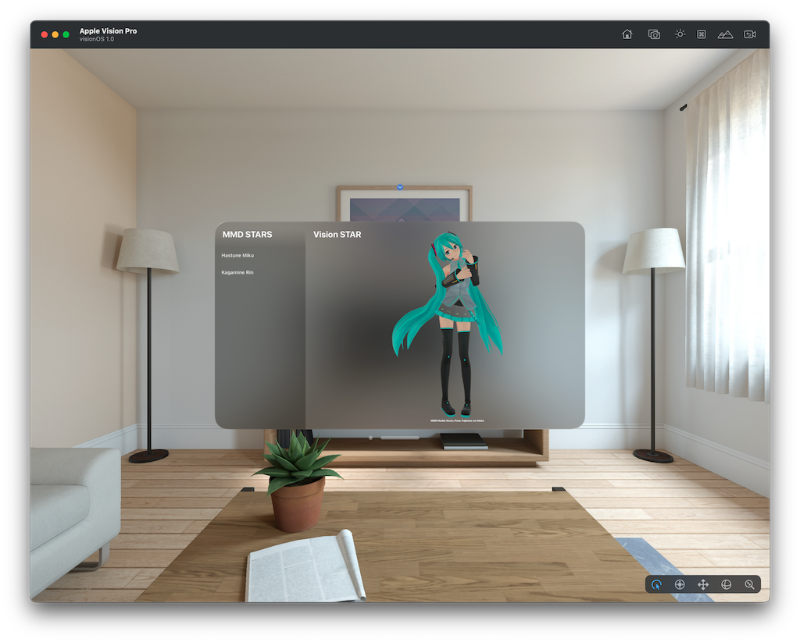
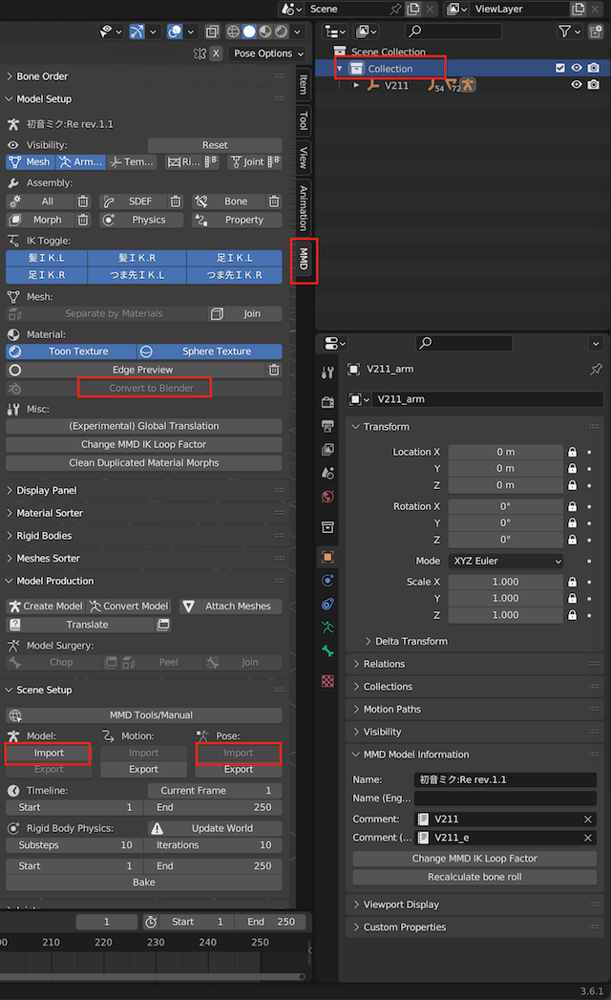
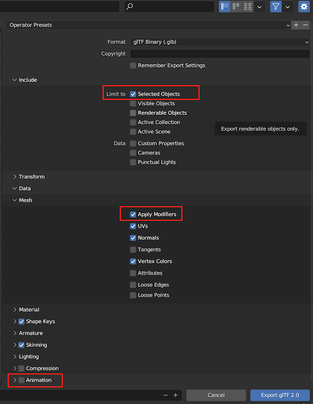

# Hastune Miku on Vision Pro

[日本語版 README](README-JP.md)

## Project Purpose
The virtual singer, Hatsune Miku, has many fans around the world, regardless of gender, age, and culture. Therefore, I wanted to animate her using Apple Vision Pro. To do this, it's necessary to convert her 3D model, the "MikuMikuDance format," into Pixar's "USDZ format." However, I couldn't find a clear procedure on the Internet. So, I thought it might be useful to share the method I used on GitHub. Along the way, I encountered problems that I couldn't solve, and I hope the community can help me.

 
## Installation and Execution
Using the starter template for the Vision program, I loaded her in a pose. Please clone this repository and open it in XCode 15.0 beta. When you launch the Vision Pro simulator, she will appear.

 
## Directly View the Model in the Repository - Distribution Prohibited
The model being displayed is included in this repository. The file name is v211_moko_03.usdz. You can download this and view it directly, for example, in Mac's preview. However, distribution of this model is prohibited by the copyright owner of Hatsune Miku. Please see the licensing terms for more details.

 
## How to Convert MikuMikuDance Format to USDZ
I converted the MMD format to USDZ using the following method.

### Main Steps
 1. Import Hatsune Miku's 3D model into Blender.
 1. Apply a pose to the imported model.
 1. Export this in glTF 2.0 format.
 1. Convert the glTF to USDZ using RealityConverter.

 
### Tools Prepared
 * Blender 3.6.1
 * Blender Add On mmd_tools 2.8.1
    * You can download it from here https://github.com/UuuNyaa/blender_mmd_tools
 * RealityConverter 

 
### Models and Poses to Prepare
 * Download Hatsune Miku's 3D model. You can find many by searching on DeviantArt. The file extension to download is pmx.
 * I used Koron V2.1.1, which I found through this link https://www.deviantart.com/mavaphia/art/Download-Series-Koron-Miku-V2-767399172.
 * Download the pose file. You can also find many by searching for 'MMD Pose' on DeviantArt, etc. The file extension is vpd.
 * I used Fujiwara-no-Moko No.3 from this link https://www.deviantart.com/fujiwara-no-moko/art/Pose-pack-Download-827831384.

### Skeletons and Poses
Even though all are called Hatsune Miku, many creators have made their unique models. The types are very diverse, and each model is attractive, but the skeletons are subtly different, and not all combinations of models and poses fit perfectly. Please find your favorite combination.

 
### Procedure
I put a red frame around the confusing parts in the images. Please use them as a reference.

 1. Start Blender.
 1. Prepare by installing the Add-On mmd_tools. Follow the instructions in the link's manual.
 1. Remove the Camera, Light, Cube displayed on the Blender's initial screen.
 1. Open the side palette, select the "MMD" tab.
 1. Click "Model: Import" and import the downloaded 3D model. The file extension is pmx. Load this with the default settings.
 1. Click "Pose: Import" and import the downloaded pose. The file extension is vpd. Load this with the default settings.
 1. Select "Collection" from the side menu, right-click. Select "Select Objects" from the popup menu.
 1. Click "Convert to Blender" in this state.
 1. From the File menu, select "Export", then select "glTF 2.0" from it.
 1. On the Export screen, make the following settings.
 1. Include -> Limit to -> Check "Selected Object"
 1. Mesh -> Check "Apply Modifiers"
 1. Animation -> Turn off checkboxes
 1. Give it a suitable name and click the "Export to giTF 2.0" button.
 1. Launch RealityConverter and load the output .glb file.
 1. It will be automatically converted to usdz format. Save it when done.

## Problems
The costume becomes transparent depending on the viewing angle. This does not happen in Blender. It seems to be a side effect of converting to USDZ, but I do not know how to solve it. I have searched the internet, but it remains unclear. I would be happy if you could inform me of the solution through an issue.

 
## The Same Applies to Animation
If you apply a motion file (extension vmd) instead of a pose file, animation is also possible. But the result was the same.

 
## License
The copyright of Hatsune Miku belongs to Crypton Future Media, Inc. The model in this repository is a secondary work by the creator and is protected by the PCL license. Therefore, please use this model only for program verification. Permission is needed to redistribute it, even for personal use. The Vision program borrowed Apple's sample.

 
## Acknowledgments
I would like to thank UuuNyaa for developing an excellent add-on.  
I am grateful to Koron for creating an ultra-high-quality model.  
Thanks to Fujiwara-no-Moko for providing a cute pose.
